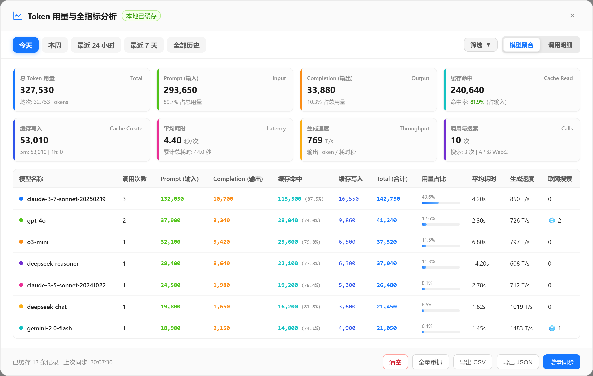
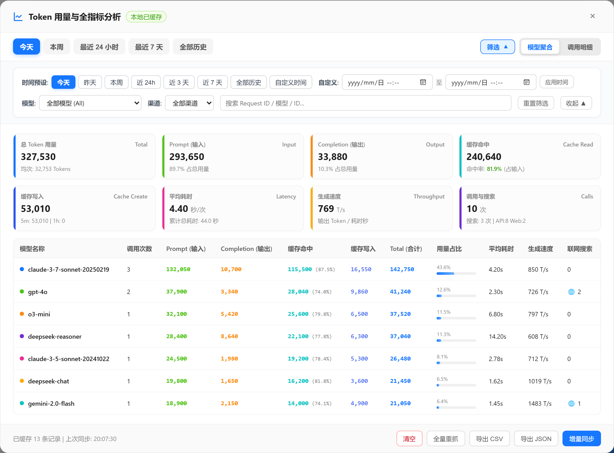
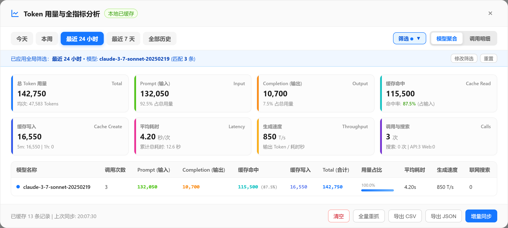
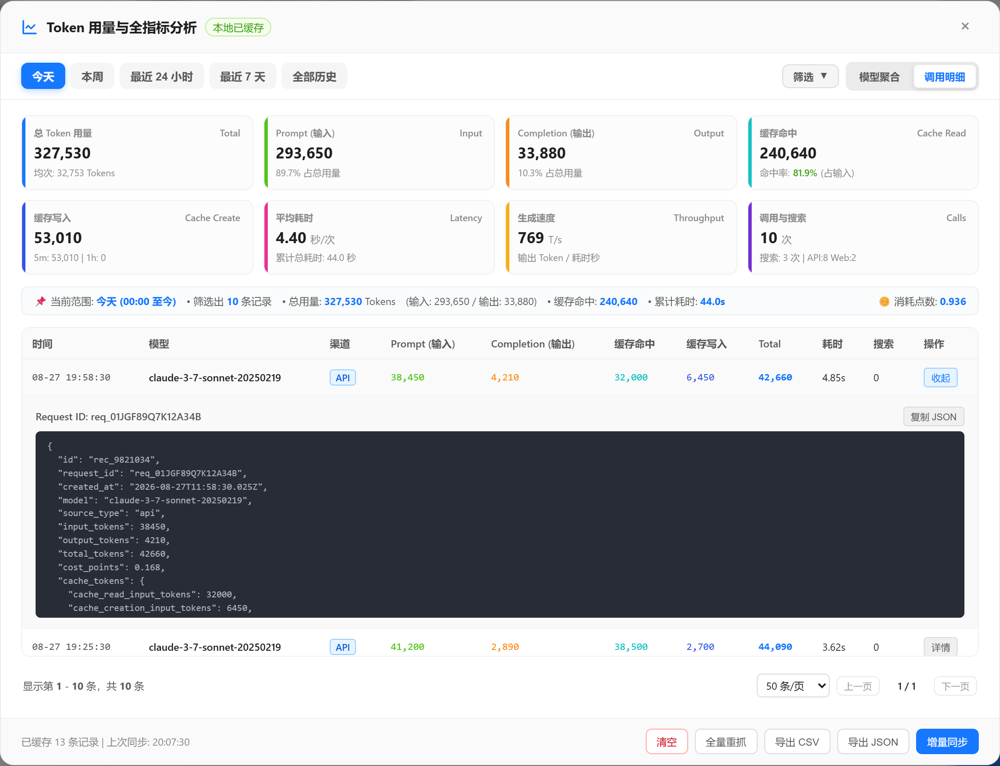

# BAI Token 用量与全指标多维度聚合统计

[](./LICENSE)
[](./bai_token_analytics.user.js)
[](https://www.tampermonkey.net/)

专为 [chat.b.ai](https://chat.b.ai/) 设计的 Token 用量与全指标多维度统计、分析与排查油猴脚本。


---

## 🌟 核心功能一览

### 1. 📊 核心指标 8 宫格与模型聚合报表

- **全面覆盖 API 所有关键指标**：
  - 📊 **Token 基础用量**：Prompt (输入)、Completion (输出)、Total (合计)、点数消耗 (Cost Points)；
  - ⚡ **缓存细分（Prompt Caching）**：**缓存命中量 (Cache Read)**、**缓存命中率 (%)**、**缓存写入量 (Cache Create)**、5分钟/1小时创建量；
  - ⏱️ **响应耗时与生成吞吐**：单次平均响应耗时 (Latency, 秒)、平均生成速率 (Throughput, Tokens/s)；
  - 🌐 **扩展能力统计**：联网搜索总次数 (Web Search Count)、请求渠道分布 (API 密钥调用 vs Web 网页端调用)。
- **各模型用量聚合表**：自动按模型分组统计调用次数、各类 Token、缓存命中率、耗时、生成速度与占比进度条。



---

### 2. 🔍 全局多维度与精准时间筛选器

- 🌐 **全局联动过滤**：筛选条件即时作用于整个面板（8 宫格核心指标卡、模型聚合统计表、调用明细表以及导出数据）；
- 🎛️ **默认隐藏/折叠设计**：面板上方提供「🔍 筛选」开关按钮，保持主界面清爽简洁，点击即可平滑展开高级筛选；
- 🕒 **快捷时间范围预设**：一键切换「今天」、「昨天」、「本周」、「近 24 小时」、「近 3 天」、「近 7 天」、「全部历史」及「自定义时间」；
- 📅 **精准日期时间筛选器**：支持原生 `datetime-local` 精确选择起始日期时间与结束日期时间（精确到分秒）；
- 🤖 **模型 & 渠道组合过滤**：支持指定特定模型（附带调用计数）、请求渠道（API / Web）及 Request ID / 模型名称模糊搜索；
- 🏷️ **智能状态提示条**：当筛选栏处于折叠状态且有筛选生效时，顶部自动呈现小蓝提示条，并支持一键修改或重置；
- 📄 **灵活分页控件**：明细视图支持 20 / 50 / 100 / 200 条每页切换与翻页。

#### 筛选面板展开状态：


#### 筛选生效时的紧凑提示条状态：


---

### 3. 📋 实时调用明细与 Raw JSON 深度排查

- **时间序调用清单**：按时间倒序清晰罗列每一次 API / Web 调用的详细指标；
- **一键展开 Raw JSON**：点击「详情」即可直观查看服务端返回的完整原始 JSON 响应；
- **便捷快捷操作**：支持一键复制 Request ID 与完整 JSON，方便与官方技术支持对账或排查调用异常。



---

### 4. ⚡ 本地持久化与智能增量同步

- 💾 **本地持久化存储（0 秒秒开）**：基于 `GM_setValue` / `GM_getValue`（支持 `localStorage` 自动降级）将历史用量安全保存在本地，页面刷新、重开浏览器无需重复抓取，打开即呈现统计结果；
- 🔄 **智能增量同步（毫秒级更新）**：仅抓取最新调用记录，遇到本地已缓存记录自动停止翻页，极大缩减同步时间并防止触发接口限流 (429)；
- 📥 **完整数据导出**：
  - **导出 CSV**：导出当前全局筛选范围下的汇总指标、各模型统计以及精确调用明细清单；
  - **导出 JSON**：包含聚合统计与完整结构化记录数组。

---

## 🚀 安装方法

### 方式一：直接在 Tampermonkey 中新建脚本（推荐）

1. 在浏览器右上角点击 **Tampermonkey（油猴）** 扩展图标，选择 **「添加新脚本」**；
2. 清空编辑器原有代码，将 [`bai_token_analytics.user.js`](./bai_token_analytics.user.js) 中的全部代码复制粘贴进去；
3. 按 `Ctrl + S`（Mac 上 `Cmd + S`）保存；
4. 打开或刷新 [https://chat.b.ai/](https://chat.b.ai/)，即可在页面右下角看到 **「📊 Token 用量统计」** 悬浮胶囊按钮。

### 方式二：本地安装服务器（开发者）

如需通过 Tampermonkey 的 URL 安装方式本地调试，可以启动内置的本地 HTTP 安装服务器：

```bash
npm install
npm start
# 服务启动后访问：http://127.0.0.1:3333/bai_token_analytics.user.js
```

---

## 📋 使用说明

1. 访问 [https://chat.b.ai/](https://chat.b.ai/) 任意页面；
2. 点击页面右下角的 **「📊 Token 用量统计」** 蓝色胶囊按钮；
3. **初次使用**：脚本将自动抓取历史用量记录并建立本地持久化存储；
4. **日常使用**：打开面板即刻秒开显示本地统计，点击 **「🔄 增量同步」** 仅需毫秒级即可拉取最新调用明细；
5. 通过顶部快捷 Tab 切换时间维度（今天 / 本周 / 最近 24h / 最近 7 天 / 全部历史）；
6. 点击右上角 **「🔍 筛选」** 按钮可展开高级筛选面板，精确设置起止时间、特定模型或请求渠道；
7. 通过右上角视图切换器在 **「📊 模型聚合」** 与 **「📋 调用明细」** 间自由切换；
8. 点击底部 **「导出 CSV」** 或 **「导出 JSON」** 导出当前筛选后的完整报表。

---

## 📄 License

[MIT License](./LICENSE) © 2026 Antigravity
