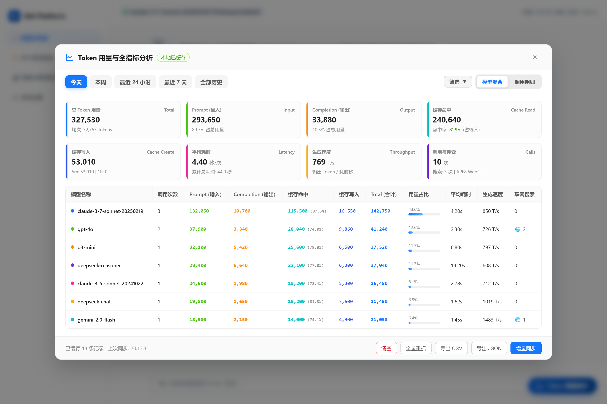

# BAI Token 用量多维度聚合统计

[](./LICENSE)
[](./bai_token_analytics.user.js)
[](https://www.tampermonkey.net/)

专为 [chat.b.ai](https://chat.b.ai/) 设计的 Token 用量多维度统计与分析油猴脚本。



## 🌟 核心功能

1. **本地持久化存储（0 秒秒开）**：
   - 基于 `GM_setValue` / `GM_getValue`（支持 `localStorage` 自动降级）将历史用量记录安全保存在本地；
   - 页面刷新、重开浏览器无需重复全量抓取，打开即刻呈现统计结果。

2. **智能增量同步（毫秒级更新）**：
   - 仅抓取最新调用记录，遇到本地已缓存记录自动停止翻页；
   - 绝大多数情况下仅需请求 1 页即可完成同步，极大节省网络带宽并防止触发接口限流 (429)。

3. **四种时间维度聚合统计**：
   - 🌟 **今天**（当天 00:00:00 至今）
   - 📅 **本周**（本周一 00:00:00 至今）
   - ⏱️ **最近 24 小时**（当前时间前推 24 小时）
   - 🗓️ **最近 7 天**（当前时间前推 7 天）

4. **完整细分指标**：
   - **Prompt Tokens (输入)**
   - **Completion Tokens (输出)**
   - **Total Tokens (合计)**
   - **调用次数 (Calls)**
   - **模型用量占比进度条**
   - **单次平均 Token 用量**

5. **数据导出与缓存维护**：
   - 📥 **导出 CSV**：适合导入 Excel 进行报表分析；
   - 📦 **导出 JSON**：适合开发者做数据存档与二次分析；
   - ⚡ **全量重抓**：一键重新拉取所有历史记录；
   - 🗑️ **清空缓存**：一键清理本地持久化数据。

6. **现代化极简 UI**：
   - 悬浮胶囊按钮（右下角），支持一键呼出与隐藏；
   - 毛玻璃遮罩 + 弹簧动画弹出，与原站视觉无缝贴合；
   - 实时同步进度条与细致状态反馈。

---

## 🚀 安装方法

### 方式一：直接在 Tampermonkey 中新建脚本（推荐）

1. 在浏览器右上角点击 **Tampermonkey（油猴）** 扩展图标，选择 **「添加新脚本」**；
2. 清空编辑器原有代码，将 [`bai_token_analytics.user.js`](./bai_token_analytics.user.js) 中的全部代码复制粘贴进去；
3. 按 `Ctrl + S`（Mac 上 `Cmd + S`）保存；
4. 打开或刷新 [https://chat.b.ai/](https://chat.b.ai/)，即可在页面右下角看到 **「📊 Token 用量统计」** 按钮。

### 方式二：本地安装服务器（开发者）

如需通过 Tampermonkey 的 URL 安装方式本地调试，可以启动内置的本地 HTTP 安装服务器：

```bash
npm install
npm start
# 服务启动后访问：http://127.0.0.1:3333/bai_token_analytics.user.js
```

在 Tampermonkey 中选择「从 URL 安装」，填入上方地址即可。

---

## 📋 使用说明

1. 访问 [https://chat.b.ai/](https://chat.b.ai/) 任意页面；
2. 点击页面右下角的 **「📊 Token 用量统计」** 蓝色胶囊按钮；
3. **初次使用**：脚本将自动抓取历史用量记录并建立本地持久化存储；
4. **日常使用**：打开面板即刻秒开显示本地统计，点击 **「🔄 增量同步」** 仅需毫秒级即可拉取最新调用明细；
5. 通过顶部 Tab 切换时间维度（今天 / 本周 / 最近 24h / 最近 7 天）；
6. 点击底部 **「导出 CSV」** 或 **「导出 JSON」** 按钮导出数据，或按需使用 **「⚡ 全量重抓」** / **「🗑️ 清空」** 管理本地缓存。

---

## 🤝 贡献与反馈

欢迎提交 [Issue](../../issues) 反馈 Bug 或提出功能建议！  
Pull Request 同样欢迎，请确保改动有清晰的描述。

---

## 📄 License

[MIT License](./LICENSE) © 2026 Antigravity
